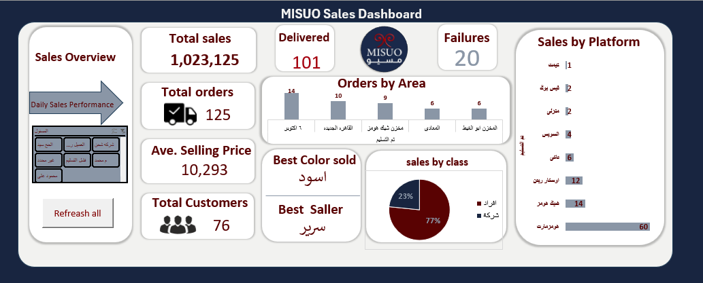
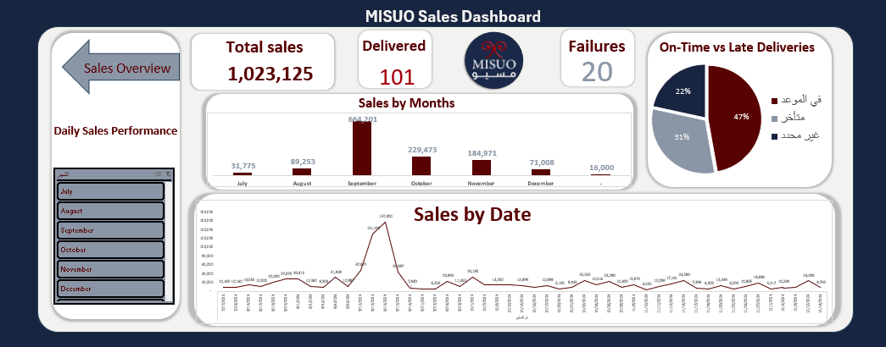

# MISUO Performance Dashboard | Excel

## 📊 Project Overview
This dashboard was a **real challenge** for me — not only because it was built using **Excel**, but because it was based on **real business data from a real company (MISUO)**.

The goal was simple but powerful:  
**Turn raw data into clear insights and actionable business decisions.**

---

## 🚀 The Data Analysis Journey
I followed the **proper data analysis workflow**, step by step:

1. **Understanding the data**  
   Exploring the business context, metrics, and relationships inside the dataset.

2. **Data Cleaning (The Hardest Part)**  
   - Messy and unstructured data  
   - Missing values  
   - Inconsistent formats  

   Without this step, any analysis would be **meaningless**.  
   Cleaning the data was the most time-consuming and critical phase of the project.

3. **Data Analysis**  
   Identifying trends, patterns, and performance gaps that matter to the business.

4. **Data Storytelling & Visualization**  
   Transforming numbers into a **clear visual story** that helps decision-makers understand performance instantly.

---

## 🧠 The Real Challenge
The biggest challenge was building a **clear, usable, and professional dashboard using Excel**.

Excel is not the strongest tool when it comes to dashboards —  
but with the **right structure, smart formulas, and clean design**, I was able to create a dashboard that is:

- Easy to read
- Business-oriented
- Decision-focused

This project proved that:
> **The power of data analysis is not in the tool —  
> it’s in the thinking process, the methodology, and understanding the data.**

---

## 📈 Dashboard Snapshots

### 🔹 Dashboard View 1

### 🔹 Dashboard View 2

---

## 🛠 Tools Used
- **Microsoft Excel**
  - Data Cleaning
  - Analysis
  - Dashboard Design
  - Business KPIs Visualization

---

## 🎯 Key Outcomes
- Clear performance monitoring
- Actionable insights for improving sales
- Better understanding of business performance
- Professional dashboard built using Excel only

---

## 📌 Final Note
This project reflects my ability to:
- Work with **real-world messy data**
- Apply a structured **Data Analysis mindset**
- Deliver **business-ready dashboards**, even with limited tools

Feel free to explore the project and reach out for collaboration 🚀
